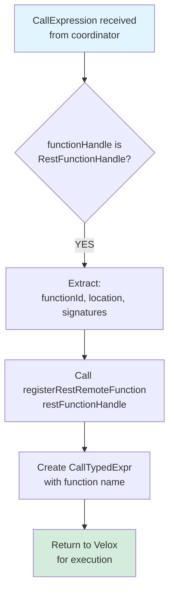
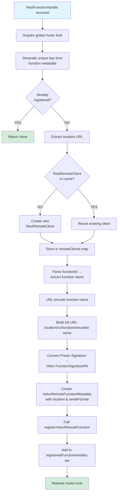
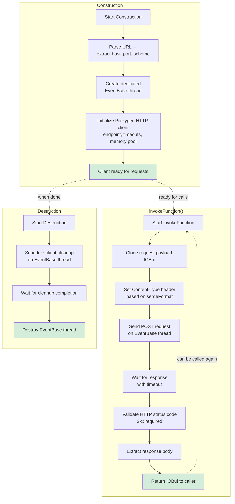
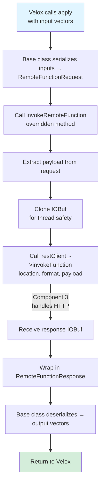
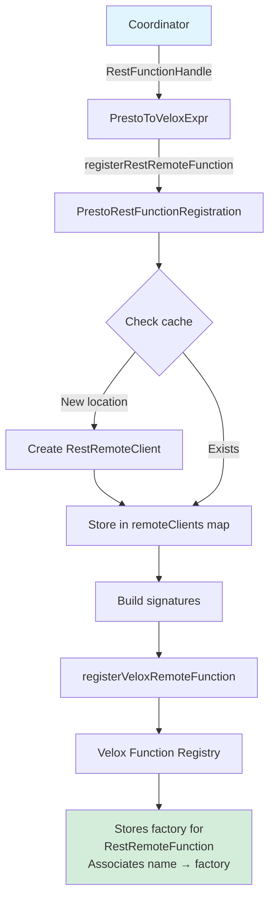
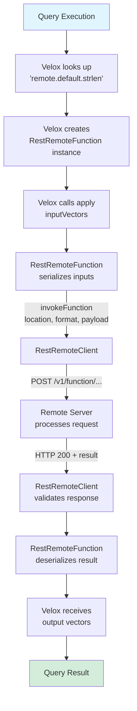
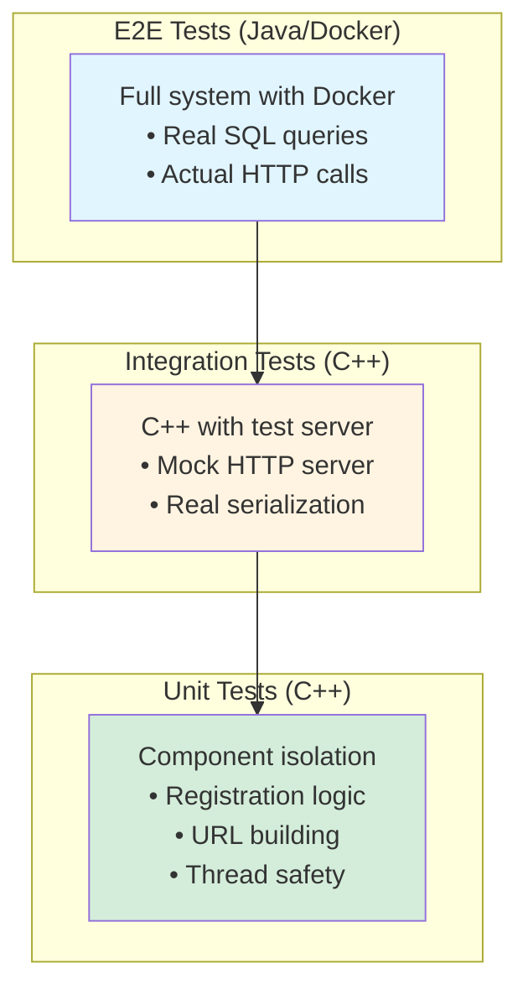

# Remote Function Execution - Complete Overview

## Table of Contents
1. [Quick Start for Reviewers](#quick-start-for-reviewers)
2. [What Changed in This PR](#what-changed-in-this-pr)
3. [Component Architecture & Interactions](#component-architecture--interactions)
4. [Data Flow Walkthrough](#data-flow-walkthrough)
5. [Review Guide by Component](#review-guide-by-component)
6. [Testing Strategy](#testing-strategy)

---

## Quick Start for Reviewers

### 30-Second Summary
This PR adds remote function execution to Presto native workers. Workers can now call functions hosted on external HTTP/REST servers instead of executing them locally.

**Impact**: New feature, zero breaking changes, optional at build time.

### Review Time Estimate
- **Quick pass**: 30 minutes (read this doc + skim key files)
- **Thorough review**: 2 hours (detailed code review)
- **Deep dive**: 4 hours (full understanding + running tests)

### Files Changed
- **Core implementation**: 8 C++ files (~500 lines)
- **Testing infrastructure**: 12 C++ files (~1,400 lines)
- **E2E tests**: 3 Java files (~180 lines)
- **Build/config**: 5 files (~20 lines)

---

## What Changed in This PR

### High-Level Changes

#### 1. New Components Added
```
presto-native-execution/presto_cpp/main/functions/remote/
├── RestRemoteClient          → HTTP client for remote calls
├── RestRemoteFunction        → Velox function wrapper
├── Registration              → Thread-safe function registry
└── tests/                    → Test server & examples
```

#### 2. Modified Existing Components
```
PrestoToVeloxExpr.cpp        → Added RestFunctionHandle detection (+18 lines)
Configs.{h,cpp}              → Added remote-function-server-serde config (+10 lines)
CMakeLists.txt               → Added PRESTO_ENABLE_REMOTE_FUNCTIONS flag (+2 lines)
```

#### 3. New Test Infrastructure
```
RemoteFunctionRestTest       → C++ integration tests
RestFunctionHandleTest       → Unit tests
TestPrestoContainer...       → Java E2E tests with Docker
```

### Configuration Changes

**New System Property**:
```properties
# Configuration file: config.properties
remote-function-server-serde=presto_page  # or "spark_unsafe_row"
```

**Build Flag**:
```cmake
# CMakeLists.txt
option(PRESTO_ENABLE_REMOTE_FUNCTIONS "Enable remote function support" ON)
```

---

## Component Architecture & Interactions

### System Overview

```mermaid
graph TD
    A[SQL Query<br/>SELECT remote.default.strlen'hello'] --> B[Presto Coordinator]
    B -->|Parses SQL<br/>Creates RestFunctionHandle| C[Presto Native Worker]
    
    subgraph Worker["Presto Native Worker"]
        C --> D[1. Expression Conversion<br/>PrestoToVeloxExpr]
        D -->|Detects RestFunctionHandle<br/>Extracts metadata| E[2. Registration<br/>PrestoRestFunctionRegistration]
        
        E -->|Thread-Safe Logic:<br/>• Parse functionId<br/>• Build URL<br/>• Get/Create RestRemoteClient<br/>• Convert Signature<br/>• Register with Velox| F[3. Execution<br/>RestRemoteFunction]
        
        F -->|Serialize input vectors<br/>to Presto Page| G[4. HTTP Request<br/>RestRemoteClient]
    end
    
    G -->|POST /v1/function/remote.default.strlen<br/>Content-Type: application/vnd.presto.page| H[Remote Function Server]
    
    subgraph Server["Remote Function Server http://function-server:8081"]
        H --> I[1. Route to Handler]
        I --> J[2. Deserialize Request<br/>Presto Page → Velox Vectors]
        J --> K[3. Execute Function<br/>strlen'hello' → 5]
        K --> L[4. Serialize Result<br/>Velox Vectors → Presto Page]
        L --> M[5. Return HTTP 200]
    end
    
    M -->|HTTP Response<br/>with result| N[RestRemoteClient<br/>validates response]
    N --> O[RestRemoteFunction<br/>deserializes result]
    O --> P[Velox Execution Engine]
    P --> Q[Query Result: 5]
    
    style Worker fill:#e1f5ff
    style Server fill:#fff4e1
    style B fill:#d4edda
    style Q fill:#d4edda
```



### Component Interaction Details

#### Component 1: PrestoToVeloxExpr (Expression Converter)

**Location**: `presto_cpp/main/types/PrestoToVeloxExpr.cpp:522-534`

**Role**: Entry point that detects remote functions

**Interaction Flow**:


**Key Code**:
```cpp
#ifdef PRESTO_ENABLE_REMOTE_FUNCTIONS
else if (auto restFunctionHandle = 
         std::dynamic_pointer_cast<protocol::RestFunctionHandle>(
             pexpr.functionHandle)) {
    
    // Trigger registration (idempotent, thread-safe)
    functions::remote::rest::registerRestRemoteFunction(*restFunctionHandle);
    
    // Create standard function call expression
    return std::make_shared<CallTypedExpr>(
        returnType, args, getFunctionName(restFunctionHandle->functionId));
}
#endif
```

**Interactions**:
- **Input**: Presto expression tree from coordinator
- **Calls**: `registerRestRemoteFunction()` in component 2
- **Output**: Velox `CallTypedExpr` that Velox can execute

---

#### Component 2: PrestoRestFunctionRegistration (Registration Manager)

**Location**: `presto_cpp/main/functions/remote/PrestoRestFunctionRegistration.{h,cpp}`

**Role**: Thread-safe function registration and client management

**Interaction Flow**:


**Key Data Structures**:
```cpp
// All protected by single static mutex
static std::mutex mutex;

// Tracks which functions are already registered
static std::unordered_set<std::string> registeredFunctionHandles;

// Cache of HTTP clients (one per location)
// Key = location URL, Value = shared RestRemoteClient
static std::unordered_map<std::string, RestRemoteClientPtr> remoteClients;
```

**Thread Safety Strategy**:
- Single global mutex protects all static state
- Double-checked locking: check before and after acquiring lock
- Idempotent: safe to call multiple times for same function
- Client reuse: prevents connection proliferation

**Interactions**:
- **Called by**: Component 1 (PrestoToVeloxExpr)
- **Creates**: Component 3 (RestRemoteClient) - one per location
- **Registers with**: Component 4 (RestRemoteFunction) via Velox
- **Uses**: Config (remoteFunctionServerSerde)

---

#### Component 3: RestRemoteClient (HTTP Client)

**Location**: `presto_cpp/main/functions/remote/client/RestRemoteClient.{h,cpp}`

**Role**: HTTP communication with remote servers

**Lifecycle**:


**Key Features**:
- **Thread-safe**: Each client has dedicated EventBase thread
- **Connection pooling**: Proxygen reuses connections automatically
- **HTTPS support**: Auto-detected from URL scheme
- **Timeout handling**: Configurable connect and request timeouts
- **Error handling**: Throws VeloxException with descriptive messages

**HTTP Protocol**:
```http
POST /v1/function/remote.default.strlen HTTP/1.1
Host: function-server:8081
Content-Type: application/vnd.presto.page
Content-Length: 1234

<binary serialized data>

Response:
HTTP/1.1 200 OK
Content-Type: application/vnd.presto.page
Content-Length: 567

<binary serialized result>
```

**Interactions**:
- **Created by**: Component 2 (Registration)
- **Called by**: Component 4 (RestRemoteFunction)
- **Calls**: Remote function server via HTTP
- **Uses**: Config (exchange timeouts)

---

#### Component 4: RestRemoteFunction (Velox Function Wrapper)

**Location**: `presto_cpp/main/functions/remote/RestRemoteFunction.{h,cpp}`

**Role**: Velox-compatible function that delegates to HTTP

**Execution Flow**:


**Key Code**:
```cpp
class RestRemoteFunction : public velox::functions::RemoteVectorFunction {
protected:
  std::unique_ptr<RemoteFunctionResponse> invokeRemoteFunction(
      const RemoteFunctionRequest& request) const override {
    
    // Clone request payload
    auto requestBody = request.inputs()->payload()->clone();
    
    // Make HTTP call via RestRemoteClient
    auto responseBody = restClient_->invokeFunction(
        location_, serdeFormat_, std::move(requestBody));
    
    // Wrap response
    auto response = std::make_unique<RemoteFunctionResponse>();
    RemoteFunctionPage result;
    result.payload_ref() = std::move(*responseBody);
    response->result_ref() = std::move(result);
    
    return response;
  }

private:
  std::string location_;           // Full URL to function endpoint
  PageFormat serdeFormat_;         // PRESTO_PAGE or SPARK_UNSAFE_ROW
  RestRemoteClientPtr restClient_; // Shared HTTP client
};
```

**Interactions**:
- **Called by**: Velox execution engine
- **Calls**: Component 3 (RestRemoteClient)
- **Uses**: Velox serialization framework
- **Returns to**: Velox for query processing

---

### Cross-Component Data Flow

#### Registration Phase (One-time per function)



#### Execution Phase (Per function call)



---

## Data Flow Walkthrough

### Example: `SELECT remote.default.strlen('hello')`

#### Phase 1: Query Planning (Coordinator)

1. **SQL Parsing**: `strlen('hello')` identified as function call
2. **Catalog Lookup**: Finds `remote.default.strlen` in catalog
3. **Create Handle**: Coordinator creates `RestFunctionHandle`:
   ```json
   {
     "functionId": "remote.default.strlen;varchar",
     "location": "http://function-server:8081",
     "signatures": [{
       "returnType": "integer",
       "argumentTypes": ["varchar"],
       "variableArity": false
     }]
   }
   ```
4. **Distribute**: Send to native workers in task specification

#### Phase 2: Expression Conversion (Worker)

5. **Receive Task**: Worker receives expression tree with `RestFunctionHandle`
6. **Convert Expression**: `PrestoToVeloxExpr::toVeloxExpr()` called
7. **Detect Remote**: Identifies `RestFunctionHandle` type
8. **Trigger Registration**:
   ```cpp
   functions::remote::rest::registerRestRemoteFunction(restFunctionHandle);
   ```

#### Phase 3: Registration (Worker, One-time)

9. **Lock Mutex**: Acquire global registration lock
10. **Check Cache**: Is "remote.default.strlen@http://..." registered?
    - **First call**: NO → continue
    - **Subsequent calls**: YES → return immediately
11. **Parse Function ID**: Extract "remote.default.strlen" from "remote.default.strlen;varchar"
12. **Get Client**: Lookup "http://function-server:8081" in `remoteClients` map
    - **First time**: Create new `RestRemoteClient`
    - **Already exists**: Reuse existing client
13. **Build URL**:
    ```
    location = "http://function-server:8081"
    functionName = "remote.default.strlen"
    encoded = "remote.default.strlen" (URL-encoded)
    fullUrl = "http://function-server:8081/v1/function/remote.default.strlen"
    ```
14. **Convert Signature**: Presto `Signature` → Velox `FunctionSignaturePtr`
15. **Create Metadata**:
    ```cpp
    VeloxRemoteFunctionMetadata {
      location = "http://function-server:8081/v1/function/remote.default.strlen",
      serdeFormat = PRESTO_PAGE
    }
    ```
16. **Register with Velox**:
    ```cpp
    registerVeloxRemoteFunction(
      "remote.default.strlen",
      signatures,
      metadata,
      restClient
    );
    ```
17. **Update Cache**: Add to `registeredFunctionHandles`
18. **Unlock Mutex**: Release registration lock

#### Phase 4: Execution (Worker, Per Call)

19. **Velox Execution**: Query executes, needs to evaluate `strlen('hello')`
20. **Function Lookup**: Velox finds registered "remote.default.strlen"
21. **Create Instance**: Instantiate `RestRemoteFunction` with metadata
22. **Prepare Input**:
    ```
    inputVector = FlatVector<StringView>(['hello'])
    ```
23. **Serialize Input**: Velox serializes to Presto Page format:
    ```
    [Page Header] [Column 0: VARCHAR] [Data: "hello"]
    → Binary IOBuf
    ```
24. **Invoke Remote**:
    ```cpp
    restClient->invokeFunction(
      "http://function-server:8081/v1/function/remote.default.strlen",
      PageFormat::PRESTO_PAGE,
      inputPayload
    );
    ```

#### Phase 5: HTTP Request (Worker)

25. **Build HTTP Request**:
    ```http
    POST /v1/function/remote.default.strlen HTTP/1.1
    Host: function-server:8081
    Content-Type: application/vnd.presto.page
    Content-Length: 98
    
    <binary Presto Page data>
    ```
26. **Send Request**: Proxygen sends via persistent connection
27. **Wait for Response**: Timeout = 60s (from config)

#### Phase 6: Server Processing (Remote Server)

28. **Receive Request**: Server's HTTP handler receives POST
29. **Route to Handler**: Lookup "remote.default.strlen" → `StrLenHandler`
30. **Deserialize**: Presto Page → Velox `RowVector`
    ```
    inputVector = ['hello']
    ```
31. **Execute Function**:
    ```cpp
    for (i = 0; i < numRows; ++i) {
      stringLen = inputVector[i].size();  // 5
      outputVector[i] = stringLen;
    }
    ```
32. **Serialize Result**: `FlatVector<int32_t>([5])` → Presto Page
33. **Send Response**:
    ```http
    HTTP/1.1 200 OK
    Content-Type: application/vnd.presto.page
    Content-Length: 45
    
    <binary Presto Page data>
    ```

#### Phase 7: Response Processing (Worker)

34. **Receive Response**: `RestRemoteClient` receives HTTP response
35. **Validate Status**: Check status code = 200 (2xx range)
36. **Extract Body**: Get response IOBuf
37. **Return to Function**: `RestRemoteFunction` receives IOBuf
38. **Deserialize**: Presto Page → Velox `FlatVector<int32_t>`
    ```
    resultVector = [5]
    ```
39. **Return to Velox**: Output vectors ready for next operator

#### Phase 8: Complete Query (Worker)

40. **Continue Execution**: Velox continues with result
41. **Send to Coordinator**: Worker sends result page
42. **Return to Client**: Final result: `5`

---

## Review Guide by Component

### Component Review Checklist

#### 1. RestRemoteClient (HTTP Client)
**Files**: `client/RestRemoteClient.{h,cpp}`

**Critical Review Points**:
- [ ] HTTP status validation (must be 2xx) - Line 93-104
- [ ] Resource cleanup in destructor - Line 53-59
- [ ] Thread-safe usage of EventBase - Line 41-50
- [ ] Timeout configuration - Line 42-48
- [ ] Error messages are descriptive - Line 98-102

**Security**:
- [ ] HTTPS support enabled - Line 38
- [ ] No credentials logged
- [ ] Buffer sizes bounded

#### 2. PrestoRestFunctionRegistration (Registration)
**Files**: `PrestoRestFunctionRegistration.{h,cpp}`

**Critical Review Points**:
- [ ] Mutex protects all static variables - Line 116-120
- [ ] Idempotent registration (checks before registering) - Line 124-127
- [ ] Client caching works correctly - Line 131-134
- [ ] URL encoding prevents injection - Line 55-57
- [ ] Signature conversion preserves all metadata - Line 73-111

**Thread Safety**:
- [ ] No race conditions in static initialization
- [ ] Lock scope is minimal
- [ ] No deadlock potential

#### 3. RestRemoteFunction (Function Wrapper)
**Files**: `RestRemoteFunction.{h,cpp}`

**Critical Review Points**:
- [ ] Payload cloning for thread safety - Line 43
- [ ] Error handling for null responses - Line 48-50
- [ ] Proper response wrapping - Line 53-58

#### 4. Expression Integration
**Files**: `types/PrestoToVeloxExpr.cpp`

**Critical Review Points**:
- [ ] Guarded by `#ifdef` - Line 522
- [ ] Follows existing pattern - Line 523-534
- [ ] No modification to existing logic

#### 5. Configuration
**Files**: `common/Configs.{h,cpp}`

**Critical Review Points**:
- [ ] Default value is sensible (presto_page)
- [ ] Config validation exists
- [ ] Property name follows convention

### Testing Review

#### Unit Tests
**File**: `types/tests/RestFunctionHandleTest.cpp`

- [ ] Covers concurrent registration
- [ ] Tests URL encoding edge cases
- [ ] Validates signature conversion
- [ ] Checks client caching

#### Integration Tests
**File**: `functions/remote/tests/RemoteFunctionRestTest.cpp`

- [ ] Server lifecycle managed properly
- [ ] Multiple data types tested
- [ ] Null handling verified
- [ ] Error scenarios covered

#### E2E Tests
**File**: `nativeworker/TestPrestoContainerRemoteFunction.java`

- [ ] Real SQL queries tested
- [ ] Container network configured
- [ ] Results validated correctly

---

## Testing Strategy

### Test Pyramid



### Test Coverage

| Component | Unit | Integration | E2E |
|-----------|------|-------------|-----|
| RestRemoteClient | ✅ | ✅ | ✅ |
| Registration | ✅ | ✅ | ✅ |
| RestRemoteFunction | ✅ | ✅ | ✅ |
| Expression Integration | ✅ | ✅ | ✅ |
| Thread Safety | ✅ | ✅ | ❌ |
| Error Handling | ✅ | ✅ | ❌ |

### Running Tests

```bash
# Build with remote functions enabled
cmake -DPRESTO_ENABLE_REMOTE_FUNCTIONS=ON ..
make

# Run unit tests
./presto_cpp/main/types/tests/RestFunctionHandleTest

# Run integration tests
./presto_cpp/main/functions/remote/tests/RemoteFunctionRestTest

# Run E2E tests (requires Docker)
cd presto-native-execution
mvn test -Dtest=TestPrestoContainerRemoteFunction
```

---

## Approval Checklist

### Before Approving, Verify:

#### Functionality
- [ ] Feature can be disabled at compile time
- [ ] No changes to existing public APIs
- [ ] Existing tests still pass
- [ ] New tests cover main scenarios

#### Code Quality
- [ ] Follows Presto C++ style guide
- [ ] No memory leaks (checked with valgrind)
- [ ] No compiler warnings
- [ ] Error messages are clear

#### Thread Safety
- [ ] All static variables protected by mutex
- [ ] No data races (checked with TSAN)
- [ ] Client lifetime managed correctly
- [ ] EventBase used properly

#### Security
- [ ] URL encoding prevents injection
- [ ] No credentials in logs
- [ ] HTTPS support works
- [ ] Input validation adequate

#### Performance
- [ ] Registration overhead is minimal
- [ ] Connection pooling works
- [ ] No unnecessary allocations
- [ ] Lock contention is low

#### Documentation
- [ ] Design doc is clear
- [ ] Code comments are helpful
- [ ] Config properties documented
- [ ] Review guide useful

---

## Summary for Reviewers

### What Makes This PR Safe?

1. **Optional Feature**: Can be disabled at build time
2. **No Breaking Changes**: Pure addition, no modifications to existing code
3. **Thread-Safe**: All shared state protected by mutexes
4. **Well-Tested**: Unit, integration, and E2E tests
5. **Incremental**: Registration happens once, execution is straightforward

### What to Focus On?

1. **Thread Safety** in `PrestoRestFunctionRegistration.cpp` (most complex)
2. **Resource Management** in `RestRemoteClient` destructor
3. **Error Handling** throughout HTTP flow
4. **Test Coverage** in all three test levels

### Potential Concerns?

1. **Global Registration Lock**: Single mutex for all registration
   - **Mitigation**: Registration is one-time per function
2. **No Authentication**: Security depends on network isolation
   - **Mitigation**: Can use HTTPS, auth can be added later
3. **No Circuit Breaker**: Failed servers keep getting retried
   - **Mitigation**: Query-level timeout prevents infinite hangs

### Questions for Follow-Up?

- Should we add authentication in v1 or defer to v2?
- Should we implement circuit breaker pattern?
- Should we add request/response compression?

---

**Document Version**: 1.0  
**Last Updated**: 2024-11-13  
**Total Review Time**: ~2 hours  
**Complexity**: Medium-High
